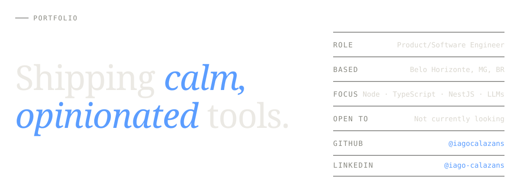
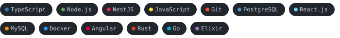

<!--
  ─────────────────────────────────────────────────────────────────────
  iagocalazans / README.md
  Inspired by iagocalazans.dev — calm, editorial, opinionated.
  Section labels are kept in monospace, headlines render from /assets.
  ─────────────────────────────────────────────────────────────────────
-->

<picture>
  <source media="(prefers-color-scheme: dark)" srcset="./assets/hero-dark.svg">
  <source media="(prefers-color-scheme: light)" srcset="./assets/hero-light.svg">
  
</picture>

&nbsp;

Product/Software engineer based in Belo Horizonte. I write Node, TypeScript and NestJS for a living, and design my own little tools on the side.

&nbsp;

<code>&nbsp;&nbsp;02 &nbsp;·&nbsp; FEATURED RELEASE &nbsp;&nbsp;</code>

### A new tool, in private beta.

> **[overflow.guru](https://overflow.guru)** — _Orçamento guiado com inteligência._
> Personal finance tools assume you already know how to budget. Overflow walks you through it: answer a handful of questions and it builds a category plan tuned to how you actually spend, then tracks the gap between intent and reality.
>
> Currently in **private beta** — used personally and opened to a small group of testers on request. No public launch planned.
>
> `· Conversational onboarding`&nbsp;&nbsp;`· Brazilian-real-first, multi-currency next`
> `· Local-first, no bank scraping`&nbsp;&nbsp;`· PWA, mobile-shaped`

&nbsp;

<code>&nbsp;&nbsp;03 &nbsp;·&nbsp; OPEN SOURCE &nbsp;&nbsp;</code>

### A small archive of libraries.

<pre>
01   • <a href="https://github.com/iagocalazans/twilio-functions-utils">twilio-functions-utils</a>         ★ 11   ◷ 1    ·   TypeScript
     This lib was created with the aim of simplifying the use of serverless Twilio.

02   • <a href="https://github.com/iagocalazans/declarative-based-flow">declarative-based-flow</a>         ★  7   ◷ 0    ·   TypeScript
     A powerful and intuitive package designed to simplify the construction
     of complex, structured workflows using a declarative and fluent syntax.

03   • <a href="https://github.com/iagocalazans/try2catch">try2catch</a>                      ★  7   ◷ 0    ·   TypeScript
     A better try/catch-like way to get your errors encapsulated.

04   • <a href="https://github.com/iagocalazans/nosep">nosep</a>                          ★  4   ◷ 0    ·   TypeScript
     Facilitates the conversion of object properties that have
     separators to the format used in JS.

05   • <a href="https://github.com/iagocalazans/aws-s3-with-parts-storage">aws-s3-with-parts-storage</a>      ★  2   ◷ 0    ·   TypeScript
     Multer's storage engine with a call to S3 as the substitution piece
     for the file system.
</pre>

&nbsp;

<code>&nbsp;&nbsp;04 &nbsp;·&nbsp; STACK &nbsp;&nbsp;</code>

### Tools I reach for.

<picture>
  <source media="(prefers-color-scheme: dark)" srcset="./assets/stack-dark.svg">
  <source media="(prefers-color-scheme: light)" srcset="./assets/stack-light.svg">
  
</picture>

<i>Filled dots mean I'd be happy to lead a team using it.</i>

&nbsp;

<code>&nbsp;&nbsp;05 &nbsp;·&nbsp; EXPERIENCE &nbsp;&nbsp;</code>

### Where I've been, lately.

<pre>
May 2026     Software/Product Engineer        ○  HQ Insights · remote from BR
Present
             AI-powered revenue growth intelligence platform unifying market,
             account, IT-spend, intent and competitor data into GTM strategy
             and activation workflows. Recently joined. More detail as the
             work takes shape.

May 2024     Senior Software Engineer         ○  Edvisor · remote from BR
Mar 2026
             Recruiting platform for international education — connecting
             agencies and partner schools. Owned the Wallet service that
             manages payments under the main platform via the Transfermate
             API, shipping a reusable integration library around it.
             Redesigned the notification system into an event-driven
             architecture (AWS SQS · Lambda · NestJS), and built LLM-powered
             internal tooling via MCP servers and the Claude API.

Feb 2022     Senior Node.js Engineer          ○  Stone · remote
Mar 2024
             Built and scaled the internal contact-center platform in
             TypeScript/NestJS on top of Twilio Voice and Twilio Flex,
             automating customer-support queue routing with Redis/MQ and
             Twilio Functions. Authored twilio-functions-utils, an
             open-source helper library that became the team's default
             scaffold for Twilio Functions. Mentored 5+ engineers and
             lifted core test coverage from 40% to 80%+.
</pre>

<i>Earlier work archived for brevity — full timeline on <a href="https://iagocalazans.dev">iagocalazans.dev</a>.</i>

&nbsp;

<code>&nbsp;&nbsp;06 &nbsp;·&nbsp; GITHUB &nbsp;&nbsp;</code>

### A year, in programming languages.

  

<i>Tracked via <a href="https://wakatime.com/@iagocalazans">Wakatime</a> — refreshed automatically.</i>

 
 

<code>&nbsp;&nbsp;07 &nbsp;·&nbsp; CONTACT &nbsp;&nbsp;</code>

<picture>
  <source media="(prefers-color-scheme: dark)" srcset="./assets/want-to-build-dark.svg">
  <source media="(prefers-color-scheme: light)" srcset="./assets/want-to-build-light.svg">
  
</picture>

&nbsp;

<pre>
EMAIL              <a href="mailto:iago.calazans@gmail.com">iago.calazans@gmail.com</a>                       copy →
PHONE              +55 31 99565-7984                             copy →
GITHUB             <a href="https://github.com/iagocalazans">github.com/iagocalazans</a>                       open →
LINKEDIN           <a href="https://linkedin.com/in/iago-calazans">linkedin.com/in/iago-calazans</a>                 open →
STACK OVERFLOW     <a href="https://stackoverflow.com/users/iago-calazans">stackoverflow.com/users/iago-calazans</a>         open →
OVERFLOW           <a href="https://overflow.guru">overflow.guru</a>                                 open →
</pre>

© 2026 · Iago Calazans · Belo Horizonte, MG, BR
